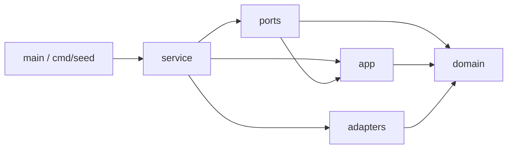
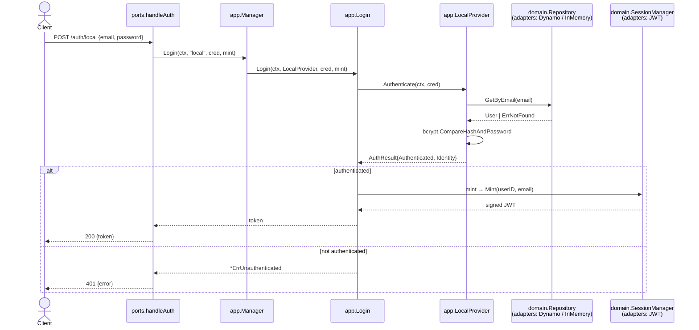
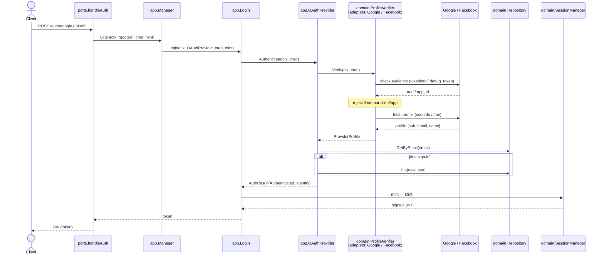
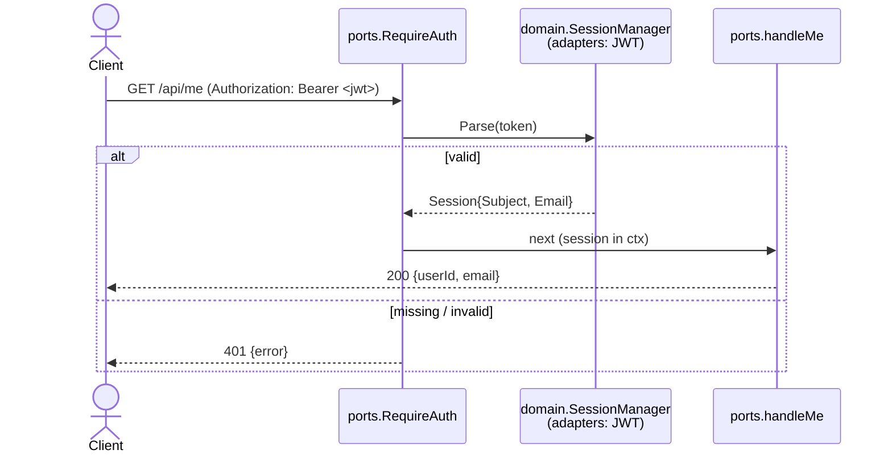

# Backend Architecture

Layered / hexagonal (Clean Architecture), after
[wild-workouts-go-ddd-example](https://github.com/ThreeDotsLabs/wild-workouts-go-ddd-example).
Packages under `internal/` are layers, and **dependencies point inward toward
`domain`**.

## Layers & dependency rule

| Layer (`internal/…`) | Role | May import |
| --- | --- | --- |
| `domain` | entities + the **port interfaces** (`IdentityProvider`, `ProfileVerifier`, `Repository`, `SessionManager`). Pure. | (nothing internal) |
| `app` | **use cases**: `Login`, `Manager` (provider registry), `LocalProvider`, `OAuthProvider` | `domain` |
| `adapters` | **driven adapters**: `Dynamo`/`InMemory`, `GoogleVerifier`/`FacebookVerifier`, JWT `SessionManager` | `domain` |
| `ports` | **driving adapter**: HTTP server, handlers, middleware | `app`, `domain` |
| `service` | composition root: wires adapters → use cases → server | all |
| `main`, `cmd/*` | entrypoints | `service` (+ adapters/domain for tools) |



Everything points at `domain`; nothing points outward. If an inner layer needs an
outer capability, it defines a **port interface in `domain`** and the outer layer
implements it.

## File map — who imports whom

Go imports are per *package*, but here each file has a single clear job, so this
reads file-to-file. `→` means "the left file's package imports the right file's
package" (only the relevant symbols shown).

| File | Imports (internal) | Provides |
| --- | --- | --- |
| `main.go` | `service` | process entrypoint; loads `.env`, starts HTTP server |
| `cmd/seed/main.go` | `adapters/dynamo`, `domain` | dev tool: create + seed the Users table |
| `service/service.go` | `ports`, `app`, `domain`, all five `adapters/*` | composition root: picks adapters, wires `app.Manager`, returns `*ports.Server` |
| `ports/server.go` | `app` (`*Manager`), `domain` (`SessionManager`) | `Server` struct + `Routes()` (the mux) |
| `ports/auth_handlers.go` | `app` (`ErrUnknownProvider`), `domain` | `handleAuth`, `writeLogin` |
| `ports/middleware.go` | `domain` | `RequireAuth`, `handleMe`, `bearerToken` |
| `ports/respond.go` | — | `writeJSON` / `writeError` / `decodeJSON` |
| `app/manager.go` | `domain` (`IdentityProvider`) | `Manager` registry + `Manager.Login` (name → provider) |
| `app/login.go` | `domain` | `Login` use case (yes/no → token / 401 / 500) |
| `app/local.go` | `domain`, `bcrypt` | `LocalProvider` (implements `IdentityProvider`) |
| `app/oauth.go` | `domain` | `OAuthProvider` (implements `IdentityProvider`) |
| `adapters/dynamo/dynamo.go` | `domain`, aws-sdk | `Repository` over DynamoDB |
| `adapters/inmem/inmem.go` | `domain` | `Repository` in memory + `NewSeeded()` |
| `adapters/google/google.go` | `domain` | `Verifier` (implements `ProfileVerifier`) |
| `adapters/facebook/facebook.go` | `domain` | `Verifier` (implements `ProfileVerifier`) |
| `adapters/jwt/jwt.go` | `domain`, golang-jwt | `Manager` (implements `SessionManager`) |
| `domain/*.go` | — | entities (`User`, `Identity`, `Session`) + port interfaces |

Note the join point: **`service` is the only file that imports a concrete
`adapters/*` package.** `ports` and `app` name only `app`/`domain` types, so the
concrete Dynamo/JWT/Google choices are invisible above `domain`.

## What each layer is for (plain language)

Read outermost → innermost:

- **`ports` — the front door (HTTP).** Receives requests from the frontend and returns
  responses; pure translation (JSON/status codes in and out). Holds no auth rules.
  It's the closest layer to "where the user interacts," but the user only reaches it
  *through* the React frontend.
- **`app` — the hidden business logic.** The use cases (`Login`, the providers). This
  is where the actual decisions happen ("wrong password → rejected"). The user never
  sees it, and it knows nothing about HTTP.
- **`domain` — the core: nouns + contracts.** Entities (`User`, `Identity`, …) and the
  **interfaces** (`Repository`, `ProfileVerifier`, `SessionManager`). The system's
  vocabulary and rulebook. Depends on nothing.
- **`adapters` — the concrete edges.** Implementations of the domain interfaces that
  touch the outside world: `Dynamo` (AWS), `Google`/`Facebook` verifiers, JWT signer,
  plus the in-memory test repo.
- **`service` — the wiring.** Picks which adapters to use and assembles the server.

**Who calls whom:** `frontend → ports → app → domain interfaces → (adapters at
runtime)`. If you ever think "the user sees `app`," re-run that chain — the user is
two hops above it.

**Two things that confuse everyone:**
1. **`app` is not user-facing.** It's deep inside; `ports` is the entry point and the
   React frontend is the actual UI.
2. **The decoupling lives in `domain`'s interfaces, not the `ports/` folder.** The
   folder named `ports/` is just HTTP; the hexagonal "ports" (interfaces) live in
   `domain`. It's an unfortunate name collision from the wild-workouts convention.

## Package call graph

```mermaid
flowchart TD
  Client([HTTP client])

  subgraph ports["ports — HTTP delivery"]
    Routes["Server.Routes"]
    HAuth["handleAuth(provider)"]
    HHealth["handleHealth"]
    HMe["handleMe"]
    MW["RequireAuth"]
    Mint["Server.mint"]
  end

  subgraph app["app — use cases"]
    Mgr["Manager.Login<br/>(name → provider)"]
    Login["Login"]
    Local["LocalProvider"]
    OAuth["OAuthProvider"]
  end

  subgraph domain["domain — entities + ports"]
    IP{{"IdentityProvider"}}
    PV{{"ProfileVerifier"}}
    Repo{{"Repository"}}
    SM{{"SessionManager"}}
  end

  subgraph adapters["adapters — driven"]
    Dyn["Dynamo"]
    Mem["InMemory"]
    GV["GoogleVerifier"]
    FV["FacebookVerifier"]
    JWT["SessionManager (JWT)"]
  end

  ExtG[("Google")]
  ExtF[("Facebook")]
  DDB[("DynamoDB")]

  Client -->|POST /auth/{provider}| Routes --> HAuth
  Client -->|GET /api/health| Routes --> HHealth
  Client -->|GET /api/me| Routes --> MW --> HMe

  HAuth --> Mgr --> Login
  Login --> IP
  Local -.implements.-> IP
  OAuth -.implements.-> IP
  Local --> Repo
  OAuth --> PV
  OAuth --> Repo

  GV -.implements.-> PV
  FV -.implements.-> PV
  Dyn -.implements.-> Repo
  Mem -.implements.-> Repo
  JWT -.implements.-> SM

  Login --> Mint --> SM
  MW --> SM

  GV -->|HTTPS| ExtG
  FV -->|HTTPS| ExtF
  Dyn -->|AWS SDK| DDB
```

The `service` layer chooses the concrete adapters (`Dynamo` vs `InMemory`,
`GoogleVerifier`, JWT `SessionManager`) and injects them where `ports`/`app`
depend only on the `domain` interfaces — so nothing above `domain` names a concrete.

## Sequence — local email/password login



## Sequence — social login (Google / Facebook)



## Sequence — protected route



## Token provenance (audience) checks

Both social verifiers confirm the access token was minted **for this app** before
trusting it — closing the token-substitution hole (a token issued to some other app,
with the same scopes, must not log its holder into FRPG). The browser keeps its
custom buttons; the check is entirely backend-side.

- **Google** (`adapters/google`): calls `tokeninfo` on the access token and rejects
  it unless `aud`/`azp` equals `GOOGLE_CLIENT_ID`, then reads the profile from
  `userinfo`.
- **Facebook** (`adapters/facebook`): calls Graph `debug_token` (authenticated with
  an app access token, `FACEBOOK_APP_ID|FACEBOOK_APP_SECRET`) and rejects the token
  unless `data.app_id` is ours and `data.is_valid`, then reads the profile from `/me`.

Each check is **skipped when its credentials are unset** (empty `GOOGLE_CLIENT_ID`, or
missing Facebook app secret), so local dev runs without them — but production MUST set
them. The Facebook App Secret is a real secret (backend-only); the Google client ID is
public.

## Next goals / things to consider

_(none open — see CONSIDERATIONS.md for parked items, e.g. explicit sign-up.)_
