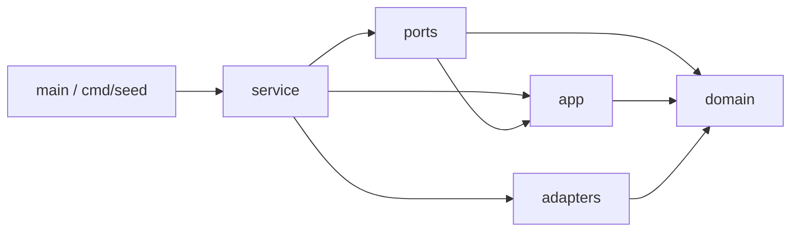
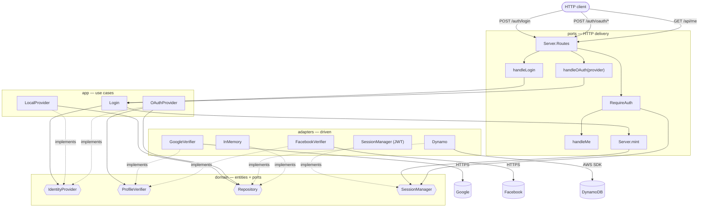
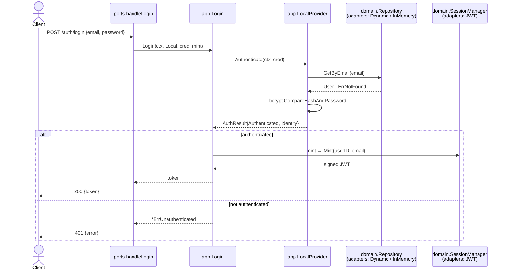
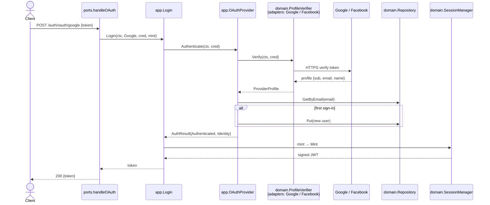
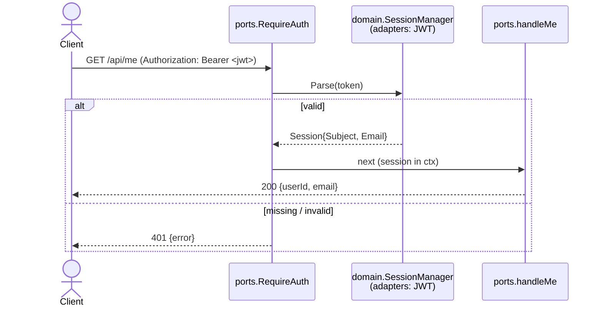

# Backend Architecture

Layered / hexagonal (Clean Architecture), after
[wild-workouts-go-ddd-example](https://github.com/ThreeDotsLabs/wild-workouts-go-ddd-example).
Packages under `internal/` are layers, and **dependencies point inward toward
`domain`**.

## Layers & dependency rule

| Layer (`internal/…`) | Role | May import |
| --- | --- | --- |
| `domain` | entities + the **port interfaces** (`IdentityProvider`, `ProfileVerifier`, `Repository`, `SessionManager`). Pure. | (nothing internal) |
| `app` | **use cases**: `Login`, `LocalProvider`, `OAuthProvider` | `domain` |
| `adapters` | **driven adapters**: `Dynamo`/`InMemory`, `GoogleVerifier`/`FacebookVerifier`, JWT `SessionManager` | `domain` |
| `ports` | **driving adapter**: HTTP server, handlers, middleware | `app`, `domain` |
| `service` | composition root: wires adapters → use cases → server | all |
| `main`, `cmd/*` | entrypoints | `service` (+ adapters/domain for tools) |

Everything points at `domain`; nothing points outward. If an inner layer needs an
outer capability, it defines a **port interface in `domain`** and the outer layer
implements it.

## Package call graph

The `service` layer chooses the concrete adapters (`Dynamo` vs `InMemory`,
`GoogleVerifier`, JWT `SessionManager`) and injects them where `ports`/`app`
depend only on the `domain` interfaces — so nothing above `domain` names a concrete.

## Sequence — local email/password login

## Sequence — social login (Google / Facebook)

## Sequence — protected route

