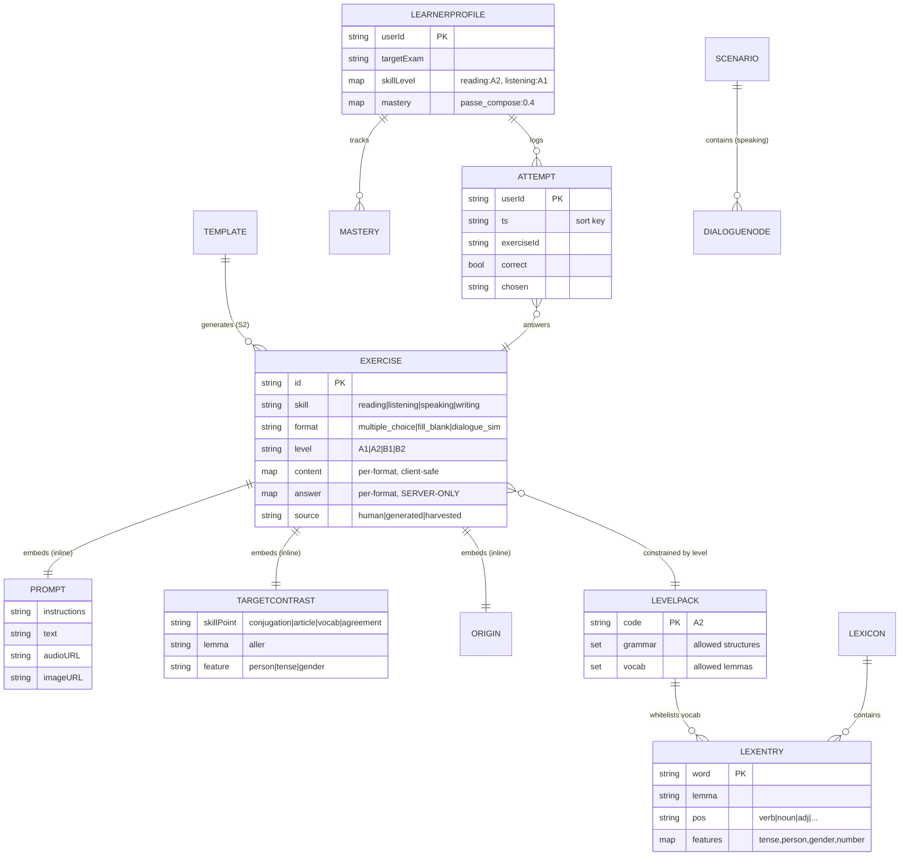
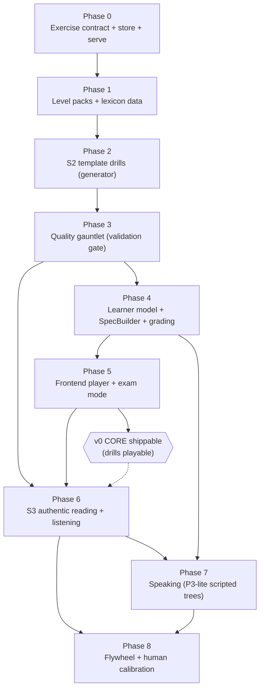
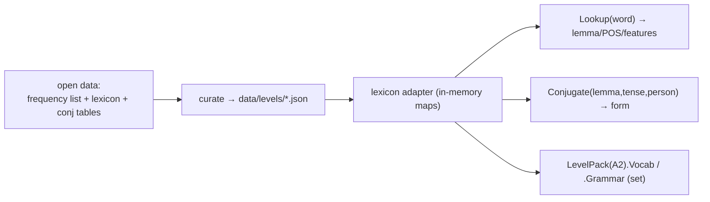
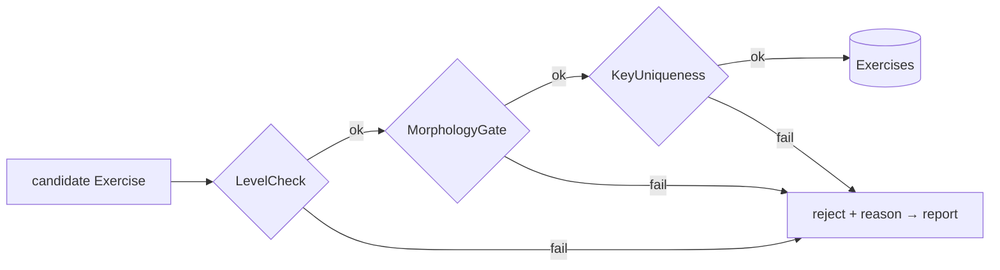
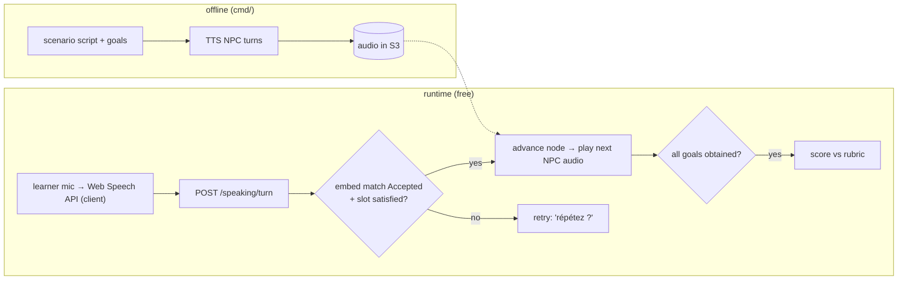

# PLAN — Exercise engine, Budget build v0 (phased)

Implementation plan for the decision in [PROPOSE.md](PROPOSE.md) ("Budget build v0").
Each **Phase has one goal and an exit gate**; you cannot start Phase *i+1* until Phase
*i*'s exit gate is green, because *i+1* consumes *i*'s contracts. Phases **0–5 are the
playable v0 core** (a real A2 learner can study drills + reading in the browser); **6–8
expand coverage and quality**.

## How this plugs into the current stack

Same hexagonal layout as auth — no new architecture, just a new **domain**:

| Layer | Auth today | Exercise engine adds |
| --- | --- | --- |
| `domain` | `User`, `Repository`, `IdentityProvider` | `Exercise`, `LevelPack`, `Lexicon`, `ExerciseStore`, `LearnerRepo`, … (entities + **ports**) |
| `app` | `Login`, `Manager`, `LocalSignUp` | `GetNext`, `Grade`, `Gauntlet`, `SpecBuilder` (use cases) |
| `adapters` | `dynamo`, `inmem`, `jwt`, `google` | `dynamo` (exercise/progress), `lexicon`, `template`, later `llm`/`tts`/`asr` |
| `ports` | `/auth`, `/signup`, `/api/me` | `/exercises`, `/next`, `/answer`, `/speaking/*` |
| `service` | wires providers | wires the exercise sources |
| `cmd/*` | `cmd/seed` | `cmd/gen-drills`, `cmd/harvest` (offline generators = the "paid, once" work) |

Rule that makes it v0: **`cmd/*` tools do all model/LLM/TTS work offline and write to
DynamoDB; `ports` only ever does static reads.** No paid call is ever on the request path.

---

## The shared data model (the contract everything fills)

Every generator writes this shape; every validator checks it; the frontend renders it.
`answer` is **server-only** and never serialized to the client.



**Reading the diagram — what's a table vs. what's inline:** boxes joined by `||--||`
"embeds" (`PROMPT`, `TARGETCONTRAST`, `ORIGIN`, and the `content`/`answer` maps) are
**value objects stored inline in the one `Exercise` item — not tables.** The actual
DynamoDB tables are only `EXERCISE` (→ `Exercises`), `LEARNERPROFILE` (→ `Progress`),
and `ATTEMPT` (→ `Attempts`). `LEVELPACK` / `LEXENTRY` are git-versioned data files
loaded into memory, not tables. So `Exercise.Contrast.SkillPoint` is one nested value
on a single row, not a join.

### Explicit Go contracts (domain)

```go
// domain/exercise.go
type Exercise struct {
    ID       string
    Skill    string          // reading | listening | speaking | writing
    Format   string          // multiple_choice | fill_blank | dialogue_sim
    Level    string          // A1 | A2 | B1 | B2
    Contrast TargetContrast  // what this item makes the learner think about
    Prompt   Prompt
    Content  map[string]any  // per-format payload — safe to send to client
    Answer   map[string]any  // per-format grading spec — NEVER sent to client
    Source   string          // human | generated | harvested
    Origin   Origin
    CreatedAt string
}
type Prompt         struct{ Instructions, Text, AudioURL, ImageURL string }
type TargetContrast struct{ SkillPoint, Lemma, Feature string }
type Origin         struct{ Model, PromptVersion string; RetrievedRefs []string; Reviewed bool; CreatedBy string }
```

### `TargetContrast`, `Prompt`, `Content` in depth

These three carry the most meaning and are the most format-dependent. **All three are
stored inline inside the single `Exercise` item** (nested maps), not in separate tables.

#### `TargetContrast` — *what the item makes the learner think about*

The field that turns "a question" into "a question with a checkable point." Without it,
a fill-blank meant to test verb conjugation could offer a **noun** as a distractor and
nothing would flag it.

| Sub-field | Meaning | What it drives |
| --- | --- | --- |
| `SkillPoint` | the pedagogical category | which validator runs · which `Mastery` bucket the attempt updates · which templates are eligible |
| `Lemma` | the specific word under test (**may be empty**) | lets the morphology gate assert "all choices are inflections of *this* word" |
| `Feature` | the axis the answer varies on (**may be empty**) | distractors must differ from the key **only** on this axis |

Valid `SkillPoint` values (extend as needed): `conjugation`, `article_gender`,
`agreement`, `preposition`, `negation`, `verb_choice`, `vocab_meaning`,
`reading_comprehension`, `listening_comprehension`.

`Lemma`/`Feature` are **filled for word-level grammar drills, empty for comprehension
items** — deliberate: a reading-comprehension MCQ tests understanding of a passage, not
one word, so the morphology gate is skipped and a different validator (answer-supported-
by-text) applies instead.

```go
// "Je ___ au marché."  (verb = aller)   choices: vais / vas / va / allons
TargetContrast{SkillPoint: "conjugation", Lemma: "aller", Feature: "person"}
// "___ maison est grande."              choices: la / le / l'
TargetContrast{SkillPoint: "article_gender", Lemma: "maison", Feature: "gender"}
// passage + "À quelle heure ferme le magasin ?"   (comprehension — no single word)
TargetContrast{SkillPoint: "reading_comprehension", Lemma: "", Feature: ""}
```

#### `Prompt` — *the stimulus the learner perceives before answering*

Multi-field precisely so **one struct serves every skill** — *which fields are filled is
the modality*:

| Field | Holds | Filled for |
| --- | --- | --- |
| `Instructions` | the task line ("Choisissez le bon verbe") | always |
| `Text` | written stimulus: sentence, passage, question stem | reading, writing |
| `AudioURL` | pointer to an audio asset (S3 / local) | listening (+ speaking model clips) |
| `ImageURL` | a picture | picture-description tasks |

Load-bearing rule: **a listening item sets `AudioURL` and leaves `Text` empty** —
showing the transcript would defeat listening. The *same* MCQ format is "reading" or
"listening" purely by whether the stimulus rides in `Text` or `AudioURL`.

```go
// reading MCQ
Prompt{Instructions: "Choisissez le bon article.", Text: "___ maison est grande."}
// listening MCQ — NO Text (don't reveal the transcript)
Prompt{Instructions: "Écoutez et répondez.", AudioURL: "media/a2/clip_017.mp3"}
```

#### `Content` — *the apparatus the learner manipulates to answer* (client-safe)

`map[string]any` because the shape depends on `Format`; the open map is the
extensibility seam (new format ⇒ new payload, no schema change). **`Content` never holds
the key** — that lives in `Answer`. Rule of thumb: `Prompt` = what you *perceive*,
`Content` = what you *interact with*, `Answer` = the *secret*.

```jsonc
// format: "multiple_choice"
"content": { "choices": [ {"id":"a","text":"la"}, {"id":"b","text":"le"}, {"id":"c","text":"l'"} ],
             "multiple": false }
// format: "fill_blank"
"content": { "template": "Je ___ au marché.", "blanks": [ {"id":"1", "hint":"aller"} ] }
// format: "dialogue_sim" (speaking) — references the scenario tree
"content": { "scenarioId": "sc_rental_a2", "goal": ["ask_price","ask_size","ask_availability"] }
```

A listening MCQ has an **audio `Prompt` and a choices `Content` at the same time** —
independent fields, which is exactly why they're separate.

#### Full example — one stored `Exercises` item (DynamoDB JSON)

Everything above nested in one record. This is literally what `ExerciseStore.Put`
writes; `GET /exercises` returns it **minus `answer`**:

```json
{
  "exerciseId": "ex_a2_art_0007",
  "skill":  "reading",
  "format": "multiple_choice",
  "level":  "A2",
  "contrast": { "skillPoint": "article_gender", "lemma": "maison", "feature": "gender" },
  "prompt":  { "instructions": "Choisissez le bon article.", "text": "___ maison est grande.",
               "audioUrl": "", "imageUrl": "" },
  "content": { "choices": [ {"id":"a","text":"la"}, {"id":"b","text":"le"}, {"id":"c","text":"l'"} ],
               "multiple": false },
  "answer":  { "correct": ["a"] },
  "source":  "generated",
  "origin":  { "model": "", "promptVersion": "tmpl-articles-v1", "retrievedRefs": [],
               "reviewed": true, "createdBy": "gen-drills" },
  "createdAt": "2026-07-03T00:00:00Z"
}
```

`GET /exercises` strips `answer`; `POST /answer` compares the learner's submission to it
server-side. A **listening** variant of this same item would differ only in `skill`
(`listening`), `contrast.skillPoint` (`listening_comprehension`), and `prompt` (empty
`text`, populated `audioUrl`) — the `content`/`answer`/format stay identical. That's the
whole flexibility argument in one diff.

### Explicit port contracts (domain interfaces, per phase that introduces them)

```go
// P0
type ExerciseStore interface {
    Get(ctx context.Context, id string) (Exercise, error)
    Query(ctx context.Context, level, skill string, limit int) ([]Exercise, error) // GSI
    Put(ctx context.Context, e Exercise) error
}
// P1
type Lexicon interface {
    Lookup(word string) (LexEntry, bool)
    Conjugate(lemma, tense, person string) (string, error)
}
type LexEntry struct{ Lemma, POS string; Features map[string]string }
type LevelPack struct{ Code string; Grammar, Vocab map[string]bool } // set membership = O(1)
// P2
type Generator interface { Generate(ctx context.Context, spec Spec) ([]Exercise, error) }
type Spec struct{ Level, Skill, Format, Topic string; Contrast TargetContrast }
// P3
type Validator interface { Check(e Exercise) Result } // Result{ OK bool; Reason string }
// P4
type LearnerRepo interface {
    Get(ctx context.Context, userID string) (LearnerProfile, error)
    Put(ctx context.Context, p LearnerProfile) error
}
type Grader interface { Grade(e Exercise, submitted map[string]any) Outcome } // per-format
```

### DynamoDB schema (three new tables; keeps auth's `Users` untouched)

| Table | PK | SK | GSI | Purpose |
| --- | --- | --- | --- | --- |
| `Exercises` | `exerciseId` | — | `byLevelSkill` (PK=`level#skill`, SK=`shard`) | the bank; GSI + random `shard` = sample "N A2 reading items" |
| `Progress` | `userId` | — | — | `LearnerProfile` (per-skill level, mastery, schedule) |
| `Attempts` | `userId` | `ts#exerciseId` | `byExercise` (PK=`exerciseId`) | answer log → grading history + item stats (S5) |

Content/audio assets: a `Media` prefix in S3 (dev: a local folder via the `AssetStore`
port). `content`/`answer` stored as native Dynamo maps.

---

## Phase dependency graph



Each arrow = "consumes the contract of." P4 can't select items until a **validated
bank** exists (P0–P3); P5 can't render until the serve/answer API exists (P4); P6's
LLM-written questions **must** pass the P3 gauntlet; P8 needs live answers (P4–P7).

---

## Phase 0 — Exercise contract, storage, and a served item

**Goal:** one hand-authored A2 exercise travels domain → Dynamo → HTTP → screen. This
nails the shared contract before anything generates against it.

**Uses from prior phase:** none (foundation). Reuses auth's patterns (`Repository`,
`dynamo` adapter, `cmd/seed`).

**Contracts introduced:** `Exercise`, `Prompt`, `TargetContrast`, `Origin`,
`ExerciseStore` (all above). Per-format `content`/`answer` shapes fixed here:

```jsonc
// multiple_choice
"content": { "choices": [ {"id":"a","text":"vais"}, {"id":"b","text":"vas"} ] }
"answer":  { "correct": ["a"] }
// fill_blank
"content": { "template": "Je ___ au marché.", "blanks": [ {"id":"1"} ] }
"answer":  { "accepted": { "1": ["vais"] } }
```

**Work:** `domain/exercise.go`; `adapters/dynamo/exercise.go` (+ `inmem` variant for
tests) implementing `ExerciseStore`; `app/exercise.go` use case `List(spec)`; `ports`
`GET /exercises?level=&skill=`; `cmd/seed` extended to insert ~5 hand-written A2 items;
minimal React render of one item (no answering yet).

**Exit gate:** `GET /exercises?level=A2&skill=reading` returns seeded items; the browser
renders an MCQ; `answer` is absent from the JSON. Store has a passing `inmem` test.

---

## Phase 1 — Level packs + morphological lexicon (the level *contract*)

**Goal:** the system can answer, deterministically and free: "is *marché* A2 vocab?",
"what's the lemma/POS of *vais*?", "conjugate *aller*, présent, 1sg". This is the data
foundation every generator and validator depends on.

**Uses from Phase 0:** the domain/ports/adapter pattern; `Exercise.Level` now points at
real packs.

**Contracts introduced:** `LevelPack`, `Lexicon`, `LexEntry` (above). Data format: JSON
files in `data/` (git-versioned, human-reviewable) loaded into memory at startup:

```jsonc
// data/levels/A2.json
{ "code":"A2",
  "grammar":["present","passe_compose","futur_proche","articles_defined"],
  "vocab":["aller","marché","manger","..."] }        // curated from open frequency lists
```

**Work:** `domain/level.go`; `adapters/lexicon/` (loads an open French lexicon —
lemma/POS/features + a conjugation table — into maps; a `conjugator` for regular +
top irregular verbs); `data/levels/A1.json`, `A2.json` (start with the two grammar
points from PROPOSE Milestone 1). **Biggest task is data curation**, not code.

**Exit gate:** `Lexicon.Conjugate("aller","present","1sg") == "vais"`; `LevelPack("A2")`
loads and set-membership is O(1); table tests cover the two target grammar points.



---

## Phase 2 — S2 template engine (first real generator)

**Goal:** `go run ./cmd/gen-drills` produces valid A2 conjugation drills into the
`Exercises` table — keys **computed** (correct by construction), vocab **from the pack**.

**Uses from Phase 1:** `Lexicon.Conjugate` (keys + distractors), `LevelPack.Vocab`
(slot fillers). **From Phase 0:** `ExerciseStore.Put`, the `content`/`answer` shapes.

**Contracts introduced:** `Template`, `Slot`, `Generator` (`TemplateSource` impl):

```go
// data/templates/*.json → loaded into:
type Template struct {
    ID       string
    Level    string          // "A2"
    Contrast TargetContrast  // {conjugation, "", person}  — lemma filled per instance
    Text     string          // Go text/template: "{{.Subject}} ___ au marché."
    Slots    []Slot          // typed: {name:"verb", pool:"A2.verbs", vary:"person"}
}
```

Distractor rule (the guarantee): for a `conjugation` contrast, distractors are **other
cells of the same paradigm** (`vais` correct → `vas`/`va`/`allons` distractors) — same
lemma, same POS, differ only in `person`. Correct-by-construction.

**Work:** `adapters/template/engine.go` (Go `text/template` + slot filler);
`data/templates/passe_compose.json`, `futur_proche.json`; `cmd/gen-drills` (fill →
build `Exercise` → `Put`). Property test: every template × every eligible verb × every
person yields an item whose `answer` matches `Conjugate(...)`.

**Exit gate:** the CLI writes ≥100 distinct A2 drills; a spot sample is grammatically
correct; the property test passes; items are servable via Phase 0's route.

---

## Phase 3 — The quality gauntlet (validation gate)

**Goal:** no item enters the bank unless it passes ordered, mostly-deterministic checks.
Turns "generated" into "trustworthy" — required before any LLM-written content (P6).

**Uses from Phase 2:** items to gate. **From Phase 1:** lexicon (POS/lemma, level check).

**Contracts introduced:** `Validator` + a `Gauntlet` composing them (mirrors the auth
`Manager` registry):

```go
type Result   struct{ OK bool; Reason string }
type Gauntlet struct{ validators []Validator }      // runs cheap→expensive, short-circuits
```

Validators (all free/deterministic for v0):
1. `LevelCheck` — every token ∈ `LevelPack.Vocab`, structure ∈ `.Grammar`.
2. `MorphologyGate` — all MCQ choices share the target POS; conjugation contrast ⇒ all
   choices are inflections of the same lemma (kills "noun among verbs").
3. `KeyUniqueness` — deterministic where rules decide; else a flagged TODO for the P6
   second-model solve.
4. `EmbeddingBand` *(optional in v0)* — `τ_low ≤ cos(key,distractor) ≤ τ_high`; wired
   only if a free/local embedding is available, else skipped with a logged note.

**Work:** `app/gauntlet.go` + `app/validators.go`; integrate into `cmd/gen-drills`
(generate → gauntlet → `Put` or reject-with-reason); a `ValidationReport` printed by the
CLI.

**Exit gate:** a deliberately-planted bad item (noun distractor) is **rejected** with a
reason; gen-drills reports pass/fail counts; only passing items are stored.



---

## Phase 4 — Learner model, SpecBuilder, scheduler, grading

**Goal:** given a learner, the app serves the *right next* item (their per-skill level,
weak-mastery first, spaced-repetition timing) and grades answers, updating mastery.

**Uses from Phases 0–3:** a **validated, populated bank** to select from (personalization
is meaningless without content). Reuses the JWT session (`/api/me`) for identity.

**Contracts introduced:** `LearnerProfile`, `LearnerRepo`, `SpecBuilder`, `Grader`,
`Scheduler`:

```go
type LearnerProfile struct {
    UserID      string
    TargetExam  string             // "TEF"
    SkillLevel  map[string]string  // reading:"A2", listening:"A1"
    Mastery     map[string]float64 // "passe_compose": 0.4
    Schedule    map[string]Review  // SM-2 state per skillPoint
}
type SpecBuilder interface { Next(p LearnerProfile) Spec } // level = skill's level; weakest mastery first; small i+1 dose
type Grader      interface { Grade(e Exercise, submitted map[string]any) Outcome }
type Outcome     struct{ Correct bool; Feedback string }
```

**Work:** `adapters/dynamo/progress.go` (`LearnerRepo`); `app/specbuilder.go`;
`app/grade.go` (deterministic MCQ/fill-blank graders + normalized string match);
`app/scheduler.go` (SM-2); `ports` `GET /next` (auth'd → profile → spec → source →
item, `answer` stripped) and `POST /answer` (grade → log `Attempt` → update mastery +
schedule). `service` wires an `ExerciseSource` selector (v0 = `StoredSource` only).

**Exit gate:** logging in as a seeded learner, `GET /next` returns a level-appropriate
unseen item; `POST /answer` returns correct/incorrect, writes an `Attempt`, and moves
mastery; a second `GET /next` reflects the update.

```mermaid
sequenceDiagram
  actor L as Learner (JWT)
  participant H as ports /next,/answer
  participant SB as app.SpecBuilder
  participant Src as ExerciseSource
  participant G as app.Grader
  participant PR as Progress + Attempts (Dynamo)
  L->>H: GET /next (Bearer)
  H->>PR: load LearnerProfile
  H->>SB: Next(profile) → Spec
  SB->>Src: pick unseen item @ skill level, weak point
  Src-->>H: Exercise (answer stripped)
  H-->>L: prompt + content
  L->>H: POST /answer {exerciseId, submitted}
  H->>G: Grade(exercise, submitted)
  G-->>H: Outcome
  H->>PR: log Attempt; update Mastery + SM-2
  H-->>L: correct? + feedback
```

---

## Phase 5 — Frontend player + exam-mode UX (v0 core ships here)

**Goal:** a learner does real drill sessions and a mini **timed, audio-plays-once,
no-hints** exam section in the browser.

**Uses from Phase 4:** `GET /next`, `POST /answer`. **From Phase 0:** the render shapes.

**Contracts:** frontend API client mirrors the JSON contracts; per-format components
key off `format`.

**Work:** React `ExercisePlayer` (renders `multiple_choice`, `fill_blank`; audio
`<player>` for listening — used in P6), a `Session` runner (streak, progress),
`ExamMode` (timer, single audio play, locked navigation, no feedback until submit), a
results screen with rough **NCLC/level mapping**. Add an "Exercises" area to the
session-gated app (Landing → play).

**Exit gate:** a learner completes a 10-item A2 drill session and one timed exam-style
block end-to-end; exam mode enforces the single-play + timer rules. **This is the v0
milestone: drills are genuinely usable.**

---

## Phase 6 — S3 authentic reading + listening (through the gauntlet)

**Goal:** real reading passages and real/near-real audio listening items join the bank,
with LLM writing only the *questions*, offline, gated by Phase 3.

**Uses from Phase 3:** the gauntlet (LLM questions MUST pass it). **From Phase 5:** the
audio player. **From Phase 1:** level-fit scoring uses the vocab pack.

**Contracts introduced:** offline capability ports (adapters called only by `cmd/`):

```go
type TextGenerator     interface { Complete(ctx, prompt string) (string, error) }   // Claude Haiku
type SpeechSynthesizer interface { Synthesize(ctx, text, voice string) ([]byte, error) } // free-tier TTS
type SpeechRecognizer  interface { Recognize(ctx, audio []byte) (string, error) }   // ASR round-trip QA
type AssetStore        interface { Put(ctx, key string, b []byte) (url string, err error) } // S3 / local
```

**Work:** `cmd/harvest` — ingest free sources (CommonVoice CC0 audio + transcripts;
learner-news passages), **level-fit filter** (% tokens ∈ A2 vocab), LLM writes MCQs
about each, gauntlet, `Put`; for generated dialogues: LLM script → TTS per speaker →
**ASR round-trip** (`Recognize(Synthesize(x)) ≈ x` else regenerate) → `AssetStore` →
`prompt.audioURL`. All offline; hot path still static.

**Exit gate:** ≥10 harvested reading items + ≥5 audio-listening items (mix of CommonVoice
and QA'd TTS dialogues) served and answerable; every LLM-written item carries `Origin`
and passed the gauntlet; a bad audio clip is caught by the round-trip and regenerated.

---

## Phase 7 — Speaking (P3-lite scripted dialogue trees)

**Goal:** a learner completes the "call about a rental ad" scenario in Chrome — obtain
the required info by asking questions — graded without any hot-path model.

**Uses from Phase 6:** TTS (pre-synthesized NPC turns → S3). **From Phase 4:** the
grading/session patterns. **From Phase 5:** the session UI.

**Contracts introduced:** the multi-turn task (a sibling of `Exercise`):

```go
type Scenario struct {
    ID       string
    Level    string
    Goal     []string        // required info the learner must obtain
    Rubric   string
    Nodes    map[string]DialogueNode
}
type DialogueNode struct {
    NPCAudioURL string          // pre-synthesized (offline)
    Accepted    []string        // learner utterances that advance (embedding-matched)
    RequireSlot string          // e.g. "asked_price"
    Next        map[string]string
}
```

Runtime (all free / client-side): browser **Web Speech API** transcribes the learner →
backend `POST /speaking/turn` → **embedding similarity** vs `Accepted` **+ slot check**
→ advance / retry with *"Je n'ai pas compris, répétez ?"*. Score = goals obtained +
question-form quality (rubric, LLM-judge **offline** on the final transcript, or a simple
keyword rubric for v0).

**Exit gate:** the scenario runs turn-by-turn in Chrome; obtaining all `Goal` items
completes it; off-script input triggers the graceful fallback; a completion score is
recorded. Non-Chrome falls back to record→playback→self-assess.



---

## Phase 8 — Flywheel (S5) + human calibration

**Goal:** the bank measurably improves and stays exam-faithful; you can answer "is an A2
item actually A2?" from data, not hope.

**Uses from Phases 4–7:** live `Attempts` (needs real answers/traffic).

**Contracts introduced:** item-stats aggregation + flags:

```go
type ItemStats struct{ ExerciseID string; Served, Correct int; DistractorPicks map[string]int; Reports int }
type Flag      string // "too_hard_for_level" | "dead_distractor" | "ambiguous_key" | "reported"
```

**Work:** aggregate `Attempts` (via the `byExercise` GSI) into `ItemStats`; a rules pass
flags pathological items (pass-rate outliers, never-picked distractors, high report
rate); retire/regrade flagged items; **feed real wrong answers back as future distractors**
(into `data/` error taxonomy for P2/P6). Human loop: a ~100-item **gold set** as QA
yardstick + a **calibration ritual** — team takes a free public TEF/TCF sample and the
app's mock; if scores don't track, the bank isn't exam-shaped yet.

**Exit gate:** a report lists per-item stats and flags; a bad seeded item is auto-flagged
and retired; the calibration ritual is documented and run once against the v0 bank.

---

## Definition of done (v0)

- **Phases 0–5:** a learner signs in, does level-appropriate A2 drills + reading, and one
  timed exam-style block, with mastery tracked — **zero recurring model cost**.
- **Phases 6–8:** authentic reading + listening, a scripted speaking task, and a quality
  loop that proves the content tracks real exam difficulty.

Everything paid (LLM, TTS, ASR) lives in `cmd/*` offline tools; `ports` stays static.
Sequence is strict: **you cannot skip a phase, because each one's exit gate is the next
one's precondition.**
