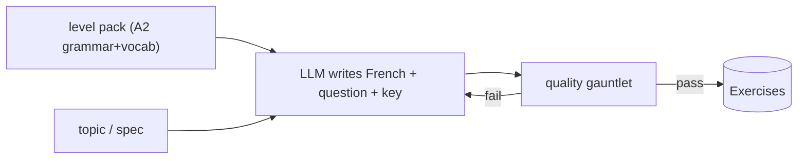
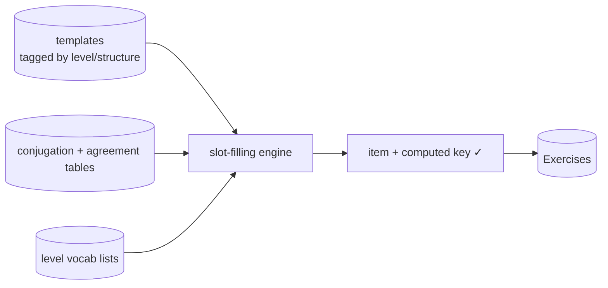
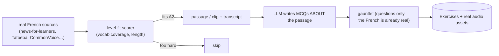
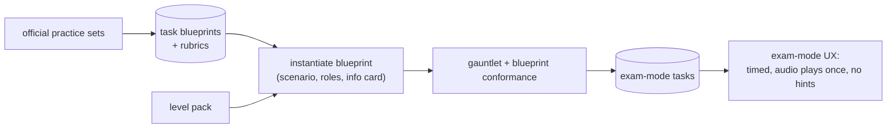
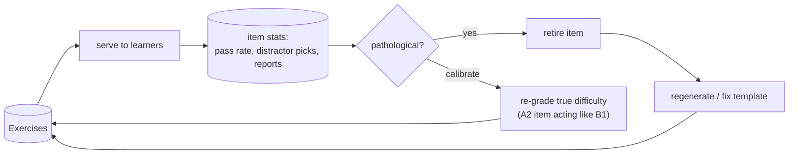
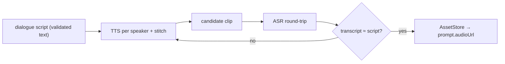
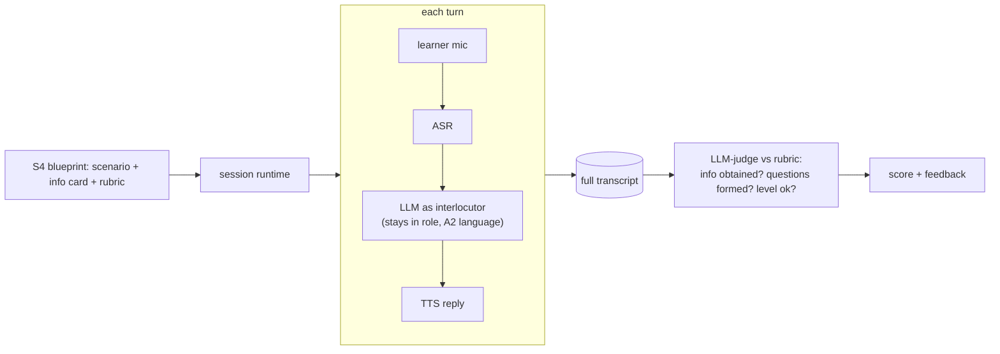
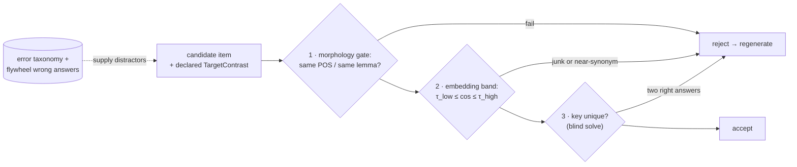
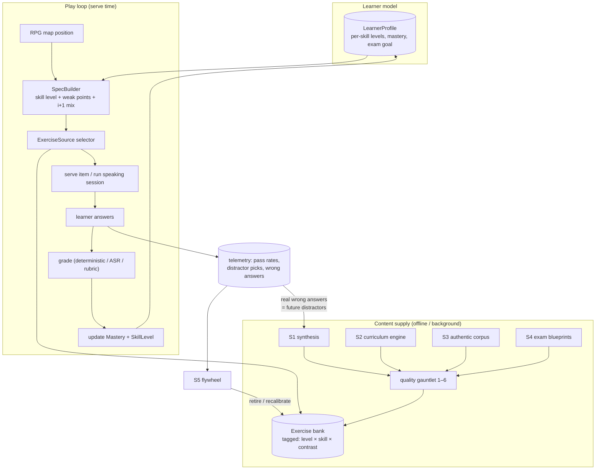

# PROPOSE — Generating exercise content that gets a learner through A1/A2 (and the exam)

**Status:** RFC v2 — **DECIDED (2026-07-03): the "Budget build v0" at the end of this
doc is the adopted plan.** The strategy sections remain the reference design; v0 is
that design in its zero-recurring-cost configuration. (v1 was scrapped: its "paths
A/B/C" were one strategy with three serving schedules, and it never answered how to
make a *real* speaking or listening item.)

## The goal, stated properly

Not "generate questions" — **reliably produce content a learner at A1/A2 can use to
learn French and pass TEF/TCF Canada.** That implies four quality bars every item
must clear:

1. **Correct** — the answer key is right; the French is grammatical.
2. **Level-faithful** — vocabulary and grammar stay inside the level's contract
   (each CEFR level owns a whitelist of structures + vocab).
3. **Natural** — French a native would actually say, not translationese.
4. **Exam-shaped** — the task resembles what TEF/TCF actually ask, so practice
   transfers to the test.

Different strategies are good at different bars — that's why we need more than one.

---

## What the exams actually ask (the target taxonomy)

Design *backward from the exam*. TEF/TCF Canada test four sections; each has
recurring **task types** (verify against official practice sets before building):

| Section | Task types (recurring shapes) | Notes for us |
| --- | --- | --- |
| **Compréhension écrite** (reading) | MCQs on signs, ads, schedules, short letters, articles | A1/A2 = everyday survival documents |
| **Compréhension orale** (listening) | MCQs on short dialogues, voicemails, announcements — **audio played ONCE**, often 2 speakers | naturalness + play-once UX matter |
| **Expression écrite** (writing) | short factual narrative (continue a *fait divers*); argue a position | graded by rubric, not answer key |
| **Expression orale** (speaking) | **interactive tasks**: obtain information (the *learner asks the questions*, e.g. call about an ad); convince someone | NOT read-aloud; multi-turn |

Two uncomfortable implications:

- **Speaking ≠ "say this sentence."** The exam's oral tasks are *interactive
  scenarios*. Read-aloud drills don't prepare anyone for "call the landlord and ask
  five questions about the apartment."
- **Listening ≠ "clean synthetic voice reads a sentence."** The exam plays
  natural-speed dialogues once. Practicing on sterile single-voice TTS under-prepares.

---

## Foundation (carried over from v1, compressed)

Still true regardless of strategy:

- **One `Exercise` type** with `Source`/`Origin` provenance — never a human/generated
  class split. Skill (delivery) ⊥ format (answer shape); `content`/`answer` are open
  per-format payloads; `answer` never ships to the client.
- **Capability ports in `domain`, implementations in `adapters`** (like
  `ProfileVerifier`): `TextGenerator` (LLM), `SpeechSynthesizer` (TTS),
  `SpeechRecognizer` (ASR), `AssetStore`, `Retriever`. Recipes compose them; all
  fakeable in tests.
- **A CEFR level is a contract, not a tag**: `Level{Code, Grammar[], Vocab}` — used
  as generation input *and* as a deterministic validator (set-membership check).
  Sourcing note: official/near-official French A1–B2 vocab & grammar inventories
  exist (CEFR *référentiels*, français fondamental, frequency lists like Lexique);
  acquiring/cleaning these is a real content task.
- **Serving schedule is an orthogonal knob, not a strategy** (v1's A/B/C/E): any
  strategy's output can be pre-generated offline, generated on demand, cached on
  first miss, or prefetched per learner. Pick per type by cost/latency; it changes
  a composition in `service`, nothing else.

---

## Five content strategies (genuinely different directions)

### S1 — Synthesis: the LLM writes the French

The default everyone assumes (and all of v1's A/B/C). Prompt an LLM with the level
pack + topic; it writes the passage, question, choices, key.



- **Strong at:** coverage on demand — any topic, any format, instantly; the only
  strategy that can fill arbitrary gaps.
- **Weak at:** every quality bar at once — it *invents* the French (naturalness
  risk), the key (correctness risk), and the level fit (checkable, but failures are
  common). Everything must be caught downstream.
- **Role:** gap-filler and drafter for other strategies — not the backbone.

### S2 — Curriculum engine: rules write the French

Typed templates + morphology tables (conjugator, agreement rules) + the level's
vocab list. The engine instantiates items; **the key is computed, so it's correct
by construction**, and level fit is by construction too.



- **Strong at:** correctness (provable), level fidelity (by construction), volume
  (combinatorial), zero marginal cost. Exactly right for A1/A2 grammar drills —
  conjugation, articles, agreement, negation — which is most of what those levels test.
- **Weak at:** naturalness ceiling (template-flavored French), no passages/dialogues,
  upfront cost of building the rules data + template DSL.
- **Role:** the **drill backbone** for A1/A2.

### S3 — Authentic corpus: don't write French — harvest it

Invert the problem: the French comes from **real sources**, and the LLM only writes
*questions about it* (a far easier task to validate than inventing French).
Candidate sources: learner-oriented news with transcripts (e.g. RFI *Français
facile*, TV5Monde's CEFR-graded materials), Tatoeba (CC sentence pairs, some with
audio), Mozilla CommonVoice French (CC0 — **real voices reading sentences**),
OpenSubtitles, public-domain texts. Select passages by **level-fit scoring**
(what % of tokens ∈ A2 vocab; sentence length; structure scan).



- **Strong at:** naturalness (it's real French, real voices), and it's the cheapest
  route to **authentic listening audio** — the thing TTS fakes.
- **Weak at:** A1 scarcity (real French is rarely A1 — expect to lean on
  learner-oriented sources), licensing diligence per source, level fit is *filtered
  for*, not guaranteed.
- **Role:** the **comprehension backbone** — reading passages and listening clips
  that feel like the exam.

### S4 — Exam-mirror: reverse-engineer the test blueprint

Make the *exam task type* the first-class unit, not the exercise. Catalog TEF/TCF
task shapes into blueprints; generation = instantiating a blueprint; validation =
conformance to it. This is deliberate teaching-to-the-test — which is the stated goal.

```go
type ExamTask struct {
    Exam      string // "TEF" | "TCF"
    Section   string // "CO" | "CE" | "EE" | "EO"
    TaskType  string // "EO-A obtain info", "CO dialogue MCQ", ...
    Blueprint string // structural constraints: parts, turns, timing, play-once
    Rubric    string // official-style grading criteria
}
```



- **Strong at:** exam-shape by definition; gives the RPG a natural "boss fight" =
  mock exam section; produces the *scenario + rubric* structures that real speaking
  practice needs (see below).
- **Weak at:** needs real study of official materials (copy the *shape*, never the
  copyrighted items); rubric grading is LLM-judged (non-deterministic); multi-turn
  tasks need a session runtime, not just an item bank.
- **Role:** the **exam-prep layer** — and the definition of "done" for A2.

### S5 — Flywheel: learners calibrate the content

How real exams ensure quality: **pilot items on people**. Instrument everything —
per-item pass rate, distractor pick-rates, time-to-answer, report button. Auto-flag
pathological items (everyone fails / nobody picks distractor B / A2 item behaves
like B1), retire them, and feed the failure patterns back into generation prompts
and template fixes. Add a small human review queue for flagged items.



- **Strong at:** the only strategy that measures **actual difficulty and quality** —
  generation-time checks can't tell you an item *plays* wrong.
- **Weak at:** needs traffic; cold-start does nothing; requires stats plumbing and
  a review UI.
- **Role:** the **quality engine** wrapped around all other strategies. Not optional
  if "reliable" is the bar — this is how you *know* you're reliable.

---

## Deep dive — how do we make an ACTUAL listening item?

The real options, honestly compared:

| Option | How | Quality | Cost | Verdict |
| --- | --- | --- | --- | --- |
| **L1. Single-voice TTS** | generated sentence → one TTS voice | clean but sterile; not exam-like | ~free | **dictation / vocab drills only** |
| **L2. Multi-voice TTS dialogue** | LLM writes a 2-speaker script → synthesize per speaker → stitch (+ pauses, light ambience) | surprisingly close to exam announcements/dialogues | low | **workhorse for generated listening** |
| **L3. Authentic audio (S3)** | real clips + transcripts (CommonVoice CC0, learner news) | real voices, real speed — the exam experience | licensing diligence | **best for exam realism** |
| **L4. Human-recorded** | voice actors / natives read generated scripts | best controllable quality | high, slow | later, for premium exam packs |

**The audio QA trick (do this whichever option):** run the produced audio through
the **ASR round-trip** — synthesize → recognize → compare the transcript to the
source script. Mismatch ⇒ the audio is unclear or mispronounced (numbers, liaisons,
proper nouns are the usual TTS failures) ⇒ regenerate. This gives audio a
*deterministic-ish* validator, like the level check gives text.



And one product rule from the exam: **exam-mode plays audio once**; practice mode
may allow replays. That's a UX flag on the exercise, decided by S4's blueprint.

## Deep dive — how do we make an ACTUAL speaking item?

"Generate text, learner reads it, ASR checks" is the *weakest* option — it trains
pronunciation, not the exam. The ladder, in increasing value:

| Option | Task | Grades | Exam relevance |
| --- | --- | --- | --- |
| **P1. Read-aloud / repeat** | say the shown/heard phrase | ASR word match (+ optional phoneme score) | low — warm-up drills |
| **P2. Prompted monologue** | picture/scenario → speak freely 30–60s | ASR transcript → LLM-judge vs rubric | medium (TCF opinion tasks) |
| **P3. Interactive dialogue simulation** | model plays a role ("landlord with an apartment ad"); learner must *obtain 5 pieces of info* by asking questions; multi-turn | task completion (info obtained?) + question formation + rubric over the whole transcript | **this IS TEF EO Section A** |
| **P4. Pronunciation drills** | minimal pairs, phoneme targeting | pronunciation scorer | supplement — the exam barely grades this directly |

**P3 is the destination** and it's a different *kind* of thing: not an item with a
key, but a **scenario + info-card + rubric** (S4 generates exactly these) plus a
**session runtime** (multi-turn state, the LLM as interlocutor via realtime-ish
STT→LLM→TTS). Grade in two separated dimensions:

- **"Did they say the right things?"** — from the ASR transcript: info obtained,
  questions well-formed, level-appropriate vocab. LLM-judge with the rubric.
- **"Did they say it well?"** — phonology/fluency, needs a pronunciation scorer;
  explicitly **defer** this (the exam transcript-level skills matter more first).



Model note: this introduces a **multi-turn task** alongside single-shot exercises —
either `format:"dialogue_sim"` whose `content` holds scenario/info-card/rubric and
whose "grading" is the session judge, or a sibling `Task` entity. Decide when built;
the provenance/level machinery applies unchanged.

---

## What makes a question *good*? Item validity (the noun-among-verbs problem)

"Good" is abstract only until you name what an item is *for*. Failure mode: a
fill-blank meant to make the learner think about **conjugating the verb**, where one
choice is a noun — the learner eliminates it by category, thinks about nothing, and
the item teaches nothing. The fix is to make intent explicit and enforceable:

**Every generated MCQ/fill-blank declares its `TargetContrast`** — the one thing it
tests — and validators enforce that every choice lives inside that contrast:

```go
type TargetContrast struct {
    SkillPoint string // "conjugation" | "article" | "vocab" | "agreement" ...
    Lemma      string // "aller" (what varies is the inflection, not the word)
    Feature    string // the contrasted dimension: "person" | "tense" | "gender"
}
```

This is the generalization of S2's guarantee: **templates get valid contrast sets by
construction** (distractors = other cells of the same conjugation paradigm —
*vais/vas/va/allons*). S1/S4 outputs must *declare* the contrast so the gauntlet can
check what S2 gets for free.

Four checks, cheapest first:

1. **Morphology/POS gate (deterministic).** Using a morphological lexicon (Lexique-
   style: word → lemma, POS, inflection features), require: all choices share the
   target's POS; for a conjugation contrast, all choices are **inflections of the
   same lemma**, differing only in the declared `Feature`. The noun-among-verbs item
   dies here, for free.
2. **Embedding band (the cosine-similarity idea — two-sided).** Embed key and
   distractors; require `τ_low ≤ cos(key, distractor) ≤ τ_high`.
   *Below τ_low* → implausible junk (eliminable without thinking).
   **Above τ_high** → near-synonym → possibly a *second correct answer* → reject.
   The upper bound matters as much as the lower one.
3. **Key-uniqueness solve.** Verify no distractor also fits: deterministically where
   rules exist (grammar says only *vais* agrees with *je*); otherwise a blind
   second-model solve — "which of these options are grammatical here?" must return
   exactly the key. Catches "Je ___ au marché" accepting both *vais* and *cours*.
4. **Distractors mined from real errors (the best ones).** A distractor is good
   because *learners actually choose it*: wrong auxiliary (*j'ai allé*), missed
   agreement, faux amis. Seed from a curated per-level error taxonomy — then let the
   **S5 flywheel harvest actual wrong answers** as future distractors. Real mistakes
   are a free, self-improving supply of maximally tempting distractors.



---

## The quality gauntlet (unifies everything)

Every item, from any strategy, passes the same ordered checks — cheap and
deterministic first, expensive and judged last:

1. **Level check** — vocab/grammar ⊆ level pack (set membership; free).
2. **Key correctness** — computed by rules where possible (S2 always); else a
   second-model verification pass answering the item blind.
3. **Item validity** — the `TargetContrast` checks above: morphology gate,
   embedding band, key-uniqueness solve. *Valid ≠ good — this is the "good" gate.*
4. **Naturalness** — skip for S3 (already real); for S1/S2, an LLM-judge "would a
   native say this?" screen.
5. **Audio QA** — ASR round-trip (listening items only).
6. **Blueprint conformance** — matches the exam task shape (S4 items).
7. **Pilot calibration** — S5's live stats confirm the item *plays* at its level;
   retire/regrade otherwise.

"Reliably good for A1/A2" = nothing reaches a learner without 1–6, and nothing
*stays* in front of learners if 7 says it's bad.

---

## The whole system in one picture (learner-level at the center)

Zooming out: the five strategies are the **supply side**; what the learner actually
experiences is driven by a **learner model** — and the level is its spine. Two
design commitments:

**1. The learner has a profile, and level is per-skill.** A real learner is not
"A2" — they're A2 in reading, A1 in listening, below A1 in speaking. The profile
tracks that, plus the exam goal and a fine-grained mastery map:

```go
type LearnerProfile struct {
    TargetExam  string            // "TEF" — defines the finish line
    TargetLevel string            // "A2" — what they're trying to certify
    SkillLevel  map[string]string // per skill: reading:"A2", listening:"A1", ...
    Mastery     map[string]float64 // per grammar point / vocab domain: "passé_composé": 0.4
    Prefs       Prefs             // session length, skill mix, exam-mode on/off
}
```

**2. A `SpecBuilder` turns profile + map position into the request.** The learner
never asks for "an exercise"; the game asks on their behalf. The builder picks:
the **skill's own level** (listening drills at A1 while reading runs at A2), mostly
at-level with a controlled share of slightly-above items (comprehensible challenge),
and **weak-mastery targets first** (the 0.4 on passé composé gets priority). That's
how "focus on the user's preferred level" becomes mechanical rather than aspirational.



Note the two closed loops: the **learner loop** (answers update mastery, which
steers the next spec — personalization) and the **content loop** (answers feed the
flywheel, which prunes the bank and hands real mistakes back to generation as
distractors — reliability). The same telemetry powers both.

---

## Comparison

| | Correct key | Level-faithful | Natural French | Exam-shaped | Cost/item | A1/A2 coverage |
| --- | --- | --- | --- | --- | --- | --- |
| **S1** synthesis | weakest (verify) | checkable | risky | only if told | low | unlimited but unvetted |
| **S2** curriculum | **provable** ✓ | **by construction** ✓ | template-ish | drills only | ~0 marginal | grammar/vocab drills |
| **S3** corpus | n/a (questions only) | filtered for | **real** ✓ | close (real media) | curation | A2 ok; A1 scarce |
| **S4** exam-mirror | rubric-graded | via pack | via S1/S3 inputs | **by definition** ✓ | medium | the exam tasks themselves |
| **S5** flywheel | *measured* ✓ | *measured* ✓ | reports catch it | measured | stats infra | improves all of the above |

---

## Recommendation — the blend, and a concrete first milestone

No single strategy clears all four bars; the blend assigns each its lane:

- **S2** → grammar/vocab drills (the daily RPG loop): provable keys, level-perfect.
- **S3** → reading passages + authentic listening clips (the comprehension loop).
- **S4** → exam-task layer: listening play-once MCQs, writing prompts + rubrics, and
  the **P3 speaking simulator** — the RPG's "boss fights."
- **S1** → gap-filler (a topic S3 lacks; distractor drafting for S2/S4), always
  behind the gauntlet.
- **S5** → wraps everything once real users exist.

**Milestone 1 — "A2 vertical slice":** pick ONE exam task per section at A2:
(1) S2 drills for two A2 grammar points (passé composé, futur proche);
(2) S3: ten level-fit reading passages + ten real audio clips with MCQs;
(3) S4/L2: five play-once TTS dialogues with ASR-round-trip QA;
(4) S4/P3: one speaking scenario ("call about a rental ad") with rubric judging —
practice mode only.
That single slice exercises every port, both deep-dive pipelines, and the gauntlet —
and a real A2 learner could study from it. Evaluate, then scale horizontally.

---

## ✅ DECISION — Budget build v0 (adopted 2026-07-03)

Constraint: a team of three with **no budget**. The rule that generates the whole
plan: **every paid model runs offline, batch, once; the hot path is 100% static
reads.** Spend time (reviewing templates and scenarios once, reused thousands of
times), not money (never per-request, never per-user).

| Piece | v0 choice | Cost |
| --- | --- | --- |
| Drills (A1/A2 core) | **S2 engine**: Go `text/template` + typed slots + open conjugation/lexicon data | $0 |
| Reading | **S3 harvest**: free CC sources, level-fit filtered; Haiku writes MCQs offline | one-time ~$10s |
| Listening (sentences) | **S3**: CommonVoice French (CC0 real voices) | $0 |
| Listening (dialogues) | **L2 on free-tier TTS** (e.g. ~1M neural chars/month free): multi-voice, ASR round-trip QA, offline → S3 | $0 |
| Speaking | **P3-lite scripted trees** + browser Web Speech API (client-side, free) + embedding match | $0 |
| Serving | Path-A static: DynamoDB free tier + S3 (10k clips ≈ 1.2 GB ≈ $0.03/mo) | ~$0 |
| Quality loop | S5 = logging + stats we already store | $0 |

**Recurring ≈ $0–5/month; one-time ≈ $20–50** (offline Haiku batch for question text).

### Feasibility review — verdict: realistic, with three honest gaps

1. **CommonVoice is single sentences, not dialogues** — but TEF CO tests *dialogues*.
   v0 fix: free-tier neural TTS covers dialogues (L2 + round-trip QA); CommonVoice
   covers dictation/sentence items. Real multi-speaker recordings are a later tier.
2. **The critical path is data, not code:** the A1/A2 level packs (vocab/grammar
   lists) and a morphological lexicon (open French lexicons + frequency bands +
   manual curation). Budget the first weeks here — every guarantee depends on it.
3. **Web Speech API is Chrome-reliable only.** v0: speaking works best in Chrome;
   fallback = record → play back → show model answer (self-assessment, zero tech).
   Full LLM interlocutor + server ASR is the funded-later tier.

Also honest: **the team needs periodic access to a fluent French reviewer** (friend,
community, tutor-for-coffee) for the gold set and naturalness spot-checks. Nothing
here replaces one native-speaker hour per content batch.

### Exam-quality guarantees in v0 (how "passes A1/A2" stays true with no money)

All the reliability machinery is deterministic and free — none of it is cut:

- **Correct keys**: S2 computes them; S1 items pass the blind second-model solve
  (offline, pennies).
- **Level fidelity**: set-membership vs the level packs (free).
- **Item validity**: TargetContrast + morphology gate + embedding band +
  key-uniqueness (free — lexicon lookups and one embedding call, offline).
- **Audio QA**: ASR round-trip on every generated clip (free tier, offline).
- **Exam shape**: blueprints derived from *freely published* TEF/TCF sample papers —
  copy the task *shapes*, timing, play-once rule, section sizes; never the items.
- **Exam-mode UX**: timed sections, audio plays once, no hints — cheap to build,
  the single biggest realism win.
- **Score mapping**: report mock results on the exam's scale (→ NCLC bands), even
  roughly — it makes "am I ready?" measurable.
- **Human calibration (free)**: the team + friends take a public sample test *and*
  the app's mock; if app scores don't track real scores, the bank isn't exam-shaped
  yet. Repeat per content batch.
- **Gold set**: ~100 hand-reviewed items as the QA yardstick; spot-check each
  generation batch against it (sampled review, not exhaustive).
- **Learning, not just testing**: spaced repetition (SM-2 style, free, algorithmic)
  over the drill bank — passing the exam needs retention, not just exposure.

### v0 milestone (Milestone 1, budget edition)

Same slice as above with the v0 substitutions: S2 drills (2 grammar points) →
CommonVoice sentence-listening + free-tier-TTS dialogues (5, QA'd) → 10 harvested
reading passages → 1 scripted speaking scenario (Chrome). Ship to a handful of real
A2 learners; let the flywheel and the human-calibration check decide what scales.

**Deferred to "when there's money":** live LLM interlocutor (B1+ conversation),
server-side ASR, human-recorded audio packs, on-the-fly personalized generation.
